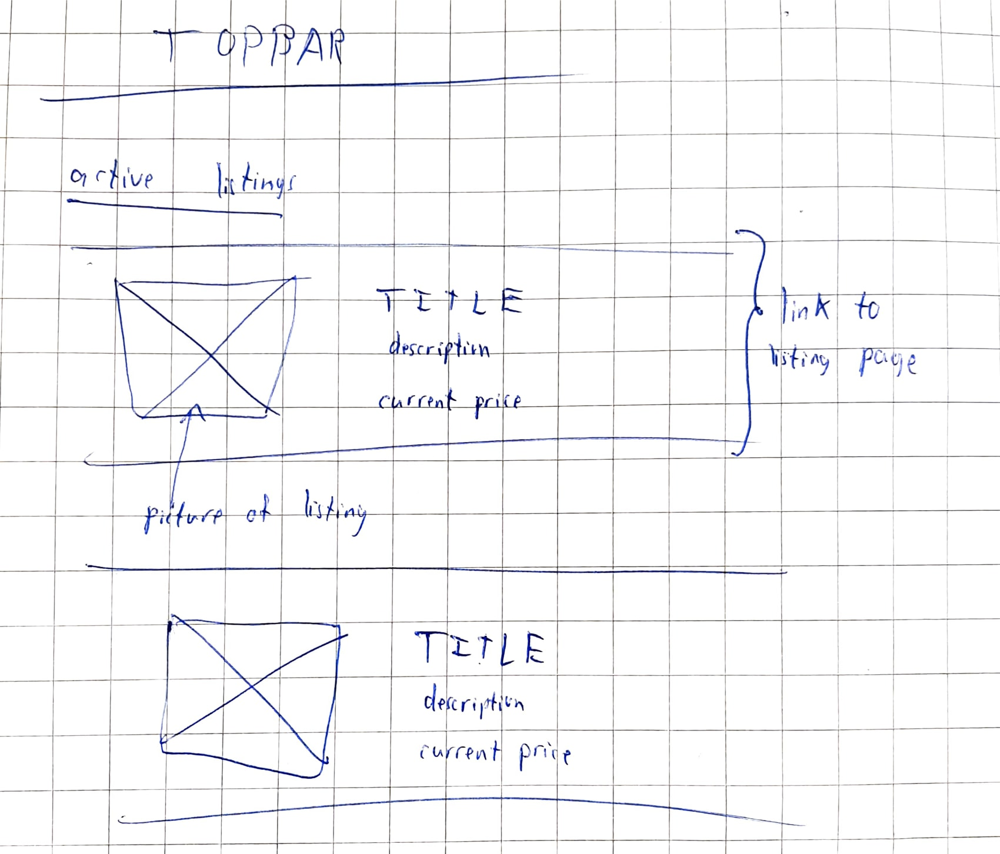
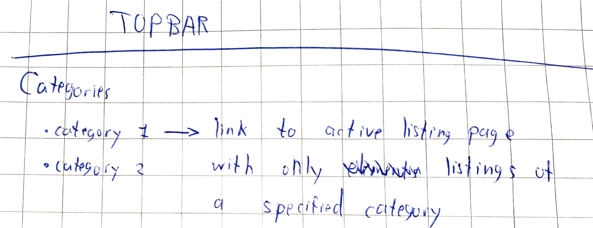

# Auction

Made by Lars Disberg\
For the minor programmeren

Auction is an online auction platform made with the Django package for python. Using Auction, 
users can list items they wish to sell and can bid on the items listed by other users.

## Getting Started

This project requires a user to have python3 installed with the Django module. Django allows its users so setup a website and allows the user to run this website as a local server. Django also helps to make a login system. The user can add listings and close their bidding. Users can also add new listings when they are logged in.

## Project requirements

Four models were used for this project. The user model contains data about a user like a username and an emailaddress.
The auction_listing model contains data about a listing like a title and a description. The bid model contains data about a bid like a value and who made the bid.
The comment model contains data about comments like the actual text and also who sent it.

Adding a listing is done on the create listing page:

When users are logged in, they are sent to the login page:

When clicking on a listing, the user can see more of its details:

When clicking on a category, users can see all listings that satisfy a given category:

When a user has added some listings to a watchlist, they can be found on a separate page:

The workflow for this project is as follows:

